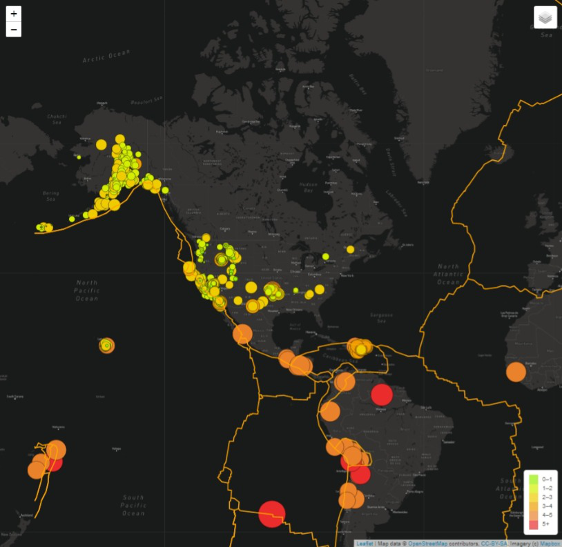

# Mapping_Earthquakes

## Project Overview
The purpose of this project is to visually show the differences between the magnitudes of earthquakes for the last seven days.

## Output

## Resources
- Data Source: earthquake.usgs.gov geojson, mapbox api
- Software: HTML, Javascript, CSS, 
